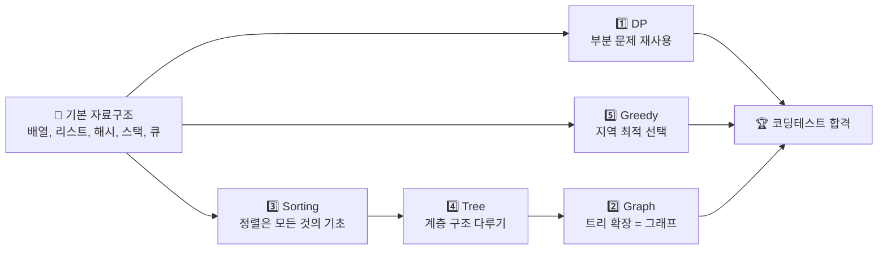
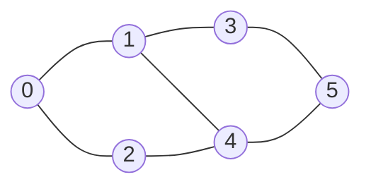
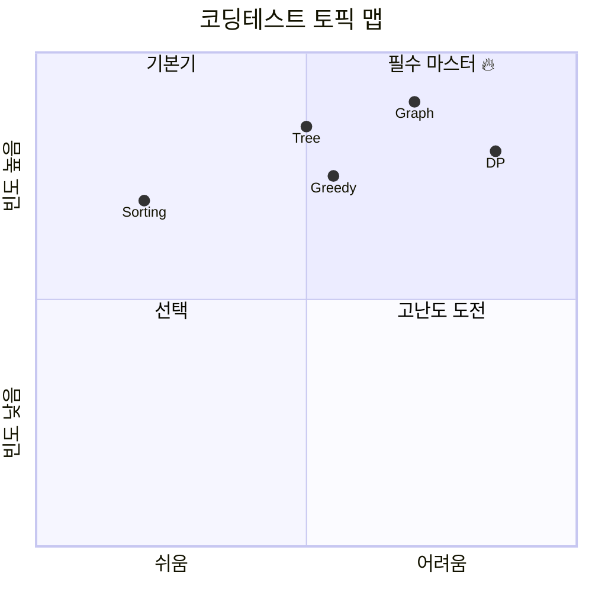

# 🎯 DSA 코딩테스트 완벽 가이드

> **Python으로 배우는 자료구조 & 알고리즘 — 5가지 핵심 토픽을 그림과 함께 쉽게**

이 저장소는 코딩테스트에서 가장 자주 나오는 **5가지 핵심 토픽**을 시각적 자료와 단계별 설명으로 정리했습니다. 각 토픽은 개념 → 그림 → 대표 예제 → 코드 분석 → 복잡도 분석 순서로 누구나 따라올 수 있도록 구성되어 있습니다.

---

## 📚 목차

| # | 토픽 | 핵심 아이디어 | 바로가기 |
|:-:|:----|:----|:-:|
| 1️⃣ | **Dynamic Programming** (동적 프로그래밍) | "같은 계산은 한 번만" — 결과를 저장해서 재사용 | [#1](#1️⃣-dynamic-programming-동적-프로그래밍) |
| 2️⃣ | **Graph** (그래프) | 정점(노드)과 간선의 연결을 탐색 | [#2](#2️⃣-graph-그래프) |
| 3️⃣ | **Sorting** (정렬) | 원소를 일정한 순서로 배열 | [#3](#3️⃣-sorting-정렬) |
| 4️⃣ | **Tree** (트리) | 계층적 구조를 탐색/조작 | [#4](#4️⃣-tree-트리) |
| 5️⃣ | **Greedy** (그리디) | 매 순간 "가장 좋아 보이는" 선택 | [#5](#5️⃣-greedy-그리디) |

---

## 🗂 전체 폴더 구조

```
dsa/
├── README.md              ← 📖 지금 보고 있는 이 문서
├── dp/                    ← 동적 프로그래밍 예제 10개 + 문서
├── graph/                 ← 그래프 예제 10개 + 문서
├── sorting/               ← 정렬 예제 10개 + 문서
├── tree/                  ← 트리 예제 10개 + 문서
└── greedy/                ← 그리디 예제 10개 + 문서
```

각 카테고리 폴더는 동일한 구조입니다.

```
<category>/
├── README.md              ← 카테고리 개요
├── 01_~ 10_*.py           ← 한국어 라인별 주석이 포함된 Python 코드
└── docs/
    └── 01_~ 10_*.md       ← 상세 설명 문서
```

---

## 🧭 학습 로드맵 한눈에 보기



> 💡 **추천 순서**: Sorting → Tree → Graph → DP → Greedy  
> 쉬운 것부터 어려운 순서이며, 앞 토픽이 뒤 토픽의 기초가 됩니다.

---

# 1️⃣ Dynamic Programming (동적 프로그래밍)

## 🎯 핵심 아이디어

> **"같은 문제를 두 번 풀지 말자"**

큰 문제를 **작은 부분 문제로 나누고**, 한 번 계산한 결과를 **저장(memoization)**해서 재사용합니다.

### DP가 적용되는 2가지 조건

```
┌─────────────────────────────────────────────────┐
│  1. 최적 부분 구조 (Optimal Substructure)       │
│     → 큰 문제의 답 = 작은 문제 답의 조합         │
│                                                  │
│  2. 중복되는 부분 문제 (Overlapping Subproblems) │
│     → 같은 계산이 여러 번 나타남                 │
└─────────────────────────────────────────────────┘
```

## 🎨 시각적 이해: 피보나치 수열

### 일반 재귀 (느림 — O(2ⁿ))

```
                F(5)
               /    \
            F(4)     F(3)          ← F(3)이 2번 계산됨
           /   \    /   \
         F(3)  F(2) F(2) F(1)     ← F(2)가 3번 계산됨
         / \   ...
       F(2) F(1)                  ← 중복 계산 폭발!
```

### DP (빠름 — O(n))

```
 인덱스:  0   1   2   3   4   5   6   7
 값:    ┌───┬───┬───┬───┬───┬───┬───┬───┐
        │ 0 │ 1 │ 1 │ 2 │ 3 │ 5 │ 8 │ 13│
        └───┴───┴───┴───┴───┴───┴───┴───┘
          ↑       ↑
         base    F(i) = dp[i-1] + dp[i-2]
```

## 📝 대표 예제: 피보나치 3가지 접근법

**문제:** `F(n) = F(n-1) + F(n-2)`, `F(0)=0`, `F(1)=1`일 때 `F(n)`을 구하라.

### 접근법 1️⃣ Top-Down (메모이제이션)

```python
def fibonacci_top_down(n, memo=None):
    if memo is None:
        memo = {}
    if n == 0: return 0                    # base case
    if n == 1: return 1                    # base case
    if n in memo: return memo[n]           # 이미 계산됐으면 재사용
    memo[n] = fibonacci_top_down(n-1, memo) + fibonacci_top_down(n-2, memo)
    return memo[n]
```

**동작 방식:**
```
F(5) 호출 → memo = {}
  F(4) 호출 → memo = {}
    F(3) 호출 → ...
      ...  (가장 작은 값부터 채워짐)
    F(2)는 memo에 있음 → 즉시 반환 ✨
  F(3)도 memo에 있음 → 즉시 반환 ✨
```

### 접근법 2️⃣ Bottom-Up (타뷸레이션)

```python
def fibonacci_bottom_up(n):
    if n <= 0: return 0
    if n == 1: return 1
    dp = [0] * (n + 1)
    dp[0], dp[1] = 0, 1
    for i in range(2, n + 1):
        dp[i] = dp[i-1] + dp[i-2]          # 작은 것부터 차곡차곡
    return dp[n]
```

### 접근법 3️⃣ Space Optimized (O(1) 공간)

```python
def fibonacci_space_optimized(n):
    if n <= 0: return 0
    if n == 1: return 1
    prev2, prev1 = 0, 1
    for _ in range(2, n + 1):
        prev2, prev1 = prev1, prev1 + prev2   # 두 변수만 유지
    return prev1
```

## 📊 복잡도 비교표

| 방법 | 시간 | 공간 | 비고 |
|:----|:-:|:-:|:----|
| 단순 재귀 | **O(2ⁿ)** ❌ | O(n) | 중복 계산 폭발 |
| Top-Down | O(n) | O(n) | 재귀 + 메모 |
| Bottom-Up | O(n) | O(n) | 반복문 + 배열 |
| Space Opt. | O(n) | **O(1)** ✅ | 변수 2개만 |

## 📦 폴더 내 예제 (10개)

| # | 파일 | 문제 |
|:-:|:----|:----|
| 1 | [`01_fibonacci.py`](dp/01_fibonacci.py) | 피보나치 수열 |
| 2 | [`02_climbing_stairs.py`](dp/02_climbing_stairs.py) | 계단 오르기 |
| 3 | [`03_coin_change.py`](dp/03_coin_change.py) | 동전 거스름돈 |
| 4 | [`04_longest_common_subsequence.py`](dp/04_longest_common_subsequence.py) | 최장 공통 부분 수열 (LCS) |
| 5 | [`05_knapsack.py`](dp/05_knapsack.py) | 0/1 배낭 문제 |
| 6 | [`06_longest_increasing_subsequence.py`](dp/06_longest_increasing_subsequence.py) | 최장 증가 부분 수열 (LIS) |
| 7 | [`07_edit_distance.py`](dp/07_edit_distance.py) | 편집 거리 |
| 8 | [`08_house_robber.py`](dp/08_house_robber.py) | 도둑 문제 |
| 9 | [`09_maximum_subarray.py`](dp/09_maximum_subarray.py) | 최대 부분 배열 (카데인 알고리즘) |
| 10 | [`10_unique_paths.py`](dp/10_unique_paths.py) | 고유 경로 |

---

# 2️⃣ Graph (그래프)

## 🎯 핵심 아이디어

> **"점(노드)과 선(간선)의 세상"**

지하철 노선도, SNS 친구 관계, 웹 링크 — 모두 그래프입니다.

### 그래프 표현 방법



**인접 리스트 (Adjacency List):**
```python
graph = {
    0: [1, 2],      # 0번 노드는 1, 2와 연결
    1: [0, 3, 4],
    2: [0, 4],
    3: [1, 5],
    4: [1, 2, 5],
    5: [3, 4],
}
```

## 🎨 BFS vs DFS 비교

### BFS (너비 우선 — 큐 사용)

```
시작: 0
  ┌─ 0 ─┐           ← 레벨 0
  ▼     ▼
  1     2           ← 레벨 1 (먼저 방문)
 ┌┴┐    │
 ▼ ▼    ▼
 3 4←───┘          ← 레벨 2
 │ │
 ▼ ▼
   5                ← 레벨 3

방문 순서: 0 → 1 → 2 → 3 → 4 → 5
💡 가까운 것부터 방문 (최단 거리 탐색에 유리)
```

### DFS (깊이 우선 — 스택/재귀)

```
시작: 0
  0
  │ (깊이 우선)
  ▼
  1 ──→ 3 ──→ 5
              │
              ▼
              4 ──→ 2 (되돌아와서 다른 경로)

방문 순서: 0 → 1 → 3 → 5 → 4 → 2
💡 끝까지 파고들고, 막히면 돌아감 (경로 탐색에 유리)
```

## 📝 대표 예제: BFS 구현

```python
from collections import deque

def bfs_traversal(graph, start):
    visited = set()                        # 방문한 노드 기록
    queue = deque([start])                 # BFS 큐 (FIFO)
    visited.add(start)
    order = []

    while queue:
        node = queue.popleft()             # 큐 앞에서 꺼냄
        order.append(node)
        for neighbor in graph.get(node, []):
            if neighbor not in visited:    # 아직 방문 안 했으면
                visited.add(neighbor)
                queue.append(neighbor)     # 큐 뒤에 추가
    return order
```

### 단계별 실행 시각화

```
초기:   queue=[0]            visited={0}         order=[]
Step 1: queue=[1, 2]         visited={0,1,2}     order=[0]
Step 2: queue=[2, 3, 4]      visited={0,1,2,3,4} order=[0,1]
Step 3: queue=[3, 4]         visited={0,1,2,3,4} order=[0,1,2]
Step 4: queue=[4, 5]         visited={0..5}      order=[0,1,2,3]
Step 5: queue=[5]            visited={0..5}      order=[0,1,2,3,4]
Step 6: queue=[]             visited={0..5}      order=[0,1,2,3,4,5] ✅
```

## 📊 주요 그래프 알고리즘

| 알고리즘 | 용도 | 시간 복잡도 |
|:----|:----|:-:|
| **BFS** | 최단 경로(무가중치), 레벨 탐색 | O(V + E) |
| **DFS** | 경로 탐색, 사이클 검출, 위상 정렬 | O(V + E) |
| **Dijkstra** | 최단 경로(양수 가중치) | O((V+E) log V) |
| **Bellman-Ford** | 최단 경로(음수 가중치 허용) | O(V·E) |
| **Floyd-Warshall** | 모든 쌍 최단 경로 | O(V³) |
| **Kruskal** | 최소 신장 트리 (MST) | O(E log E) |

> V = 정점 수, E = 간선 수

## 📦 폴더 내 예제 (10개)

| # | 파일 | 문제 |
|:-:|:----|:----|
| 1 | [`01_bfs.py`](graph/01_bfs.py) | 너비 우선 탐색 |
| 2 | [`02_dfs.py`](graph/02_dfs.py) | 깊이 우선 탐색 |
| 3 | [`03_dijkstra.py`](graph/03_dijkstra.py) | 다익스트라 최단 경로 |
| 4 | [`04_number_of_islands.py`](graph/04_number_of_islands.py) | 섬의 개수 |
| 5 | [`05_topological_sort.py`](graph/05_topological_sort.py) | 위상 정렬 |
| 6 | [`06_cycle_detection.py`](graph/06_cycle_detection.py) | 순환 탐지 |
| 7 | [`07_bellman_ford.py`](graph/07_bellman_ford.py) | 벨만-포드 |
| 8 | [`08_floyd_warshall.py`](graph/08_floyd_warshall.py) | 플로이드-워셜 |
| 9 | [`09_kruskal_mst.py`](graph/09_kruskal_mst.py) | 크루스칼 MST |
| 10 | [`10_bipartite_check.py`](graph/10_bipartite_check.py) | 이분 그래프 판별 |

---

# 3️⃣ Sorting (정렬)

## 🎯 핵심 아이디어

> **"정렬은 모든 알고리즘의 기초"**

정렬된 배열은 이진 탐색, 중복 제거, 최댓값/최솟값 찾기 등 수많은 문제를 쉽게 만듭니다.

## 🎨 정렬 알고리즘 시각적 비교

### Bubble Sort (버블 정렬)

```
이웃한 두 원소를 비교하며 교환 (큰 값이 뒤로 "거품"처럼 올라감)

초기: [5, 3, 8, 4, 2]
     비교 ↕
Pass 1:
  [5,3] → [3,5]  : [3, 5, 8, 4, 2]
  [5,8] OK       : [3, 5, 8, 4, 2]
  [8,4] → [4,8]  : [3, 5, 4, 8, 2]
  [8,2] → [2,8]  : [3, 5, 4, 2, 8]   ← 8이 끝으로!
Pass 2: [3, 4, 2, 5, 8]
Pass 3: [3, 2, 4, 5, 8]
Pass 4: [2, 3, 4, 5, 8] ✅
```

### Merge Sort (병합 정렬)

```
분할 정복: 쪼개고 → 정렬하고 → 합친다

         [5, 3, 8, 4, 2, 7]
              │ 분할
      ┌───────┴───────┐
   [5, 3, 8]      [4, 2, 7]
      │               │
   ┌──┴──┐        ┌──┴──┐
  [5,3] [8]      [4,2] [7]
   │              │
  [3,5]          [2,4]
      │               │
   [3, 5, 8]     [2, 4, 7]    ← 병합
      └───────┬───────┘
         [2, 3, 4, 5, 7, 8] ✅  ← 최종 병합
```

### Quick Sort (퀵 정렬)

```
피벗 기준으로 작은 값은 왼쪽, 큰 값은 오른쪽

[5, 3, 8, 4, 2, 7]  pivot=5
                ↓
  [3, 4, 2]  [5]  [8, 7]
      ↓            ↓
  [2][3][4]      [7][8]
                ↓
      [2, 3, 4, 5, 7, 8] ✅
```

## 📝 대표 예제: Merge Sort

```python
def merge_sort(arr):
    if len(arr) <= 1:
        return arr                         # base case: 크기 1 이하는 정렬됨

    mid = len(arr) // 2
    left = merge_sort(arr[:mid])           # 왼쪽 절반 재귀 정렬
    right = merge_sort(arr[mid:])          # 오른쪽 절반 재귀 정렬

    return merge(left, right)              # 두 정렬된 배열 병합

def merge(left, right):
    result = []
    i = j = 0
    while i < len(left) and j < len(right):
        if left[i] <= right[j]:            # 작은 쪽을 먼저 result에
            result.append(left[i])
            i += 1
        else:
            result.append(right[j])
            j += 1
    result.extend(left[i:])                # 남은 원소 추가
    result.extend(right[j:])
    return result
```

## 📊 정렬 알고리즘 비교표

| 알고리즘 | 평균 시간 | 최악 시간 | 공간 | 안정 정렬? | 특징 |
|:----|:-:|:-:|:-:|:-:|:----|
| Bubble | O(n²) | O(n²) | O(1) | ✅ | 교육용, 구현 간단 |
| Selection | O(n²) | O(n²) | O(1) | ❌ | 교환 횟수 최소 |
| Insertion | O(n²) | O(n²) | O(1) | ✅ | 거의 정렬된 배열에 빠름 |
| **Merge** | **O(n log n)** | **O(n log n)** | O(n) | ✅ | 안정적, 병합 필요 |
| **Quick** | **O(n log n)** | O(n²) | O(log n) | ❌ | 평균 가장 빠름, 캐시 친화적 |
| Heap | O(n log n) | O(n log n) | O(1) | ❌ | 우선순위 큐 |
| Counting | O(n+k) | O(n+k) | O(k) | ✅ | 정수 범위 제한시 초고속 |
| Radix | O(d·n) | O(d·n) | O(n+k) | ✅ | 자릿수 정렬 |

> n = 원소 수, k = 값의 범위, d = 자릿수

### 💡 언제 어떤 정렬?

```
📌 일반적인 경우          → Python은 내장 sort() (Timsort) 사용
📌 메모리가 넉넉하고 안정성 → Merge Sort
📌 평균적으로 가장 빠르게  → Quick Sort
📌 값 범위가 작은 정수     → Counting Sort
📌 거의 정렬된 배열        → Insertion Sort
```

## 📦 폴더 내 예제 (10개)

| # | 파일 | 알고리즘 |
|:-:|:----|:----|
| 1 | [`01_bubble_sort.py`](sorting/01_bubble_sort.py) | 버블 정렬 |
| 2 | [`02_selection_sort.py`](sorting/02_selection_sort.py) | 선택 정렬 |
| 3 | [`03_insertion_sort.py`](sorting/03_insertion_sort.py) | 삽입 정렬 |
| 4 | [`04_merge_sort.py`](sorting/04_merge_sort.py) | 병합 정렬 |
| 5 | [`05_quick_sort.py`](sorting/05_quick_sort.py) | 퀵 정렬 |
| 6 | [`06_heap_sort.py`](sorting/06_heap_sort.py) | 힙 정렬 |
| 7 | [`07_counting_sort.py`](sorting/07_counting_sort.py) | 계수 정렬 |
| 8 | [`08_radix_sort.py`](sorting/08_radix_sort.py) | 기수 정렬 |
| 9 | [`09_shell_sort.py`](sorting/09_shell_sort.py) | 셸 정렬 |
| 10 | [`10_tim_sort.py`](sorting/10_tim_sort.py) | 팀 정렬 |

---

# 4️⃣ Tree (트리)

## 🎯 핵심 아이디어

> **"사이클 없는 계층적 그래프"**

파일 시스템, HTML DOM, 데이터베이스 인덱스 — 모두 트리입니다.

## 🎨 기본 용어

```
             ⚫ 1     ← 루트(root)
           /     \
          ⚫ 2    ⚫ 3  ← 내부 노드(internal)
         /  \      \
        ⚫ 4  ⚫ 5   ⚫ 6  ← 리프(leaf) = 자식 없음
        ↑
       높이(height) = 루트에서 가장 먼 리프까지의 거리
       깊이(depth)  = 해당 노드에서 루트까지의 거리
```

## 🎨 트리 순회 (Traversal) — 4가지 방법

```
        1
       / \
      2   3
     / \
    4   5
```

### DFS 순회 (깊이 우선)

```
🔹 Preorder  (전위): 루트 → 왼쪽 → 오른쪽
   순서: 1 → 2 → 4 → 5 → 3

🔹 Inorder   (중위): 왼쪽 → 루트 → 오른쪽
   순서: 4 → 2 → 5 → 1 → 3          ← BST에서는 오름차순!

🔹 Postorder (후위): 왼쪽 → 오른쪽 → 루트
   순서: 4 → 5 → 2 → 3 → 1
```

### BFS 순회 (너비 우선)

```
🔹 Level Order: 레벨(깊이)별로 왼쪽부터
   순서: 1 → 2 → 3 → 4 → 5
```

## 🎨 BST (이진 탐색 트리)

```
왼쪽 자식 < 부모 < 오른쪽 자식

         8
        / \
       3   10
      / \    \
     1   6   14
        / \   /
       4   7 13

🔍 탐색 예 (값 6 찾기):
  8보다 작다 → 왼쪽으로 (3)
  3보다 크다 → 오른쪽으로 (6)
  찾았다! ✅

⏱️ 평균 O(log n), 최악 O(n) (한쪽으로 치우친 경우)
```

## 📝 대표 예제: Inorder Traversal (재귀 + 반복)

### 재귀 방식

```python
def inorder_recursive(root):
    result = []
    def traverse(node):
        if node is None: return
        traverse(node.left)                # 1. 왼쪽 서브트리
        result.append(node.val)            # 2. 현재 노드
        traverse(node.right)               # 3. 오른쪽 서브트리
    traverse(root)
    return result
```

### 반복 방식 (스택 사용)

```python
def inorder_iterative(root):
    result, stack = [], []
    current = root
    while current or stack:
        while current:                     # 왼쪽 끝까지 내려가면서 push
            stack.append(current)
            current = current.left
        current = stack.pop()              # 마지막에 push한 노드
        result.append(current.val)         # 방문
        current = current.right            # 오른쪽으로
    return result
```

### 단계별 시각화

```
트리:      1
          / \
         2   3
        / \
       4   5

Inorder 결과: [4, 2, 5, 1, 3]

실행 흐름:
  1에서 시작 → 왼쪽(2)로
  2에서 왼쪽(4)로
  4는 리프 → "4" 출력
  4의 오른쪽 없음 → 2로 돌아감
  "2" 출력
  2의 오른쪽(5)로
  5는 리프 → "5" 출력
  2 서브트리 끝 → 1로 돌아감
  "1" 출력
  1의 오른쪽(3)로
  "3" 출력
  종료 ✅
```

## 📊 주요 트리 연산 복잡도

| 연산 | 평균 BST | 최악 BST | 균형 BST (AVL/RB) |
|:----|:-:|:-:|:-:|
| 탐색 | O(log n) | O(n) | O(log n) |
| 삽입 | O(log n) | O(n) | O(log n) |
| 삭제 | O(log n) | O(n) | O(log n) |
| 순회 | O(n) | O(n) | O(n) |

## 📦 폴더 내 예제 (10개)

| # | 파일 | 문제 |
|:-:|:----|:----|
| 1 | [`01_inorder_traversal.py`](tree/01_inorder_traversal.py) | 중위 순회 |
| 2 | [`02_preorder_postorder.py`](tree/02_preorder_postorder.py) | 전위/후위 순회 |
| 3 | [`03_level_order_traversal.py`](tree/03_level_order_traversal.py) | 레벨 순회 |
| 4 | [`04_max_depth.py`](tree/04_max_depth.py) | 최대 깊이 |
| 5 | [`05_validate_bst.py`](tree/05_validate_bst.py) | BST 검증 |
| 6 | [`06_lowest_common_ancestor.py`](tree/06_lowest_common_ancestor.py) | 최소 공통 조상 (LCA) |
| 7 | [`07_binary_search_tree.py`](tree/07_binary_search_tree.py) | BST 연산 |
| 8 | [`08_diameter_of_tree.py`](tree/08_diameter_of_tree.py) | 이진 트리 지름 |
| 9 | [`09_serialize_deserialize.py`](tree/09_serialize_deserialize.py) | 직렬화/역직렬화 |
| 10 | [`10_balanced_binary_tree.py`](tree/10_balanced_binary_tree.py) | 균형 이진 트리 |

---

# 5️⃣ Greedy (그리디)

## 🎯 핵심 아이디어

> **"지금 이 순간, 가장 좋아 보이는 선택을 하자"**

매 단계에서 **지역 최적(local optimum)**을 선택하면 **전체 최적(global optimum)**이 되는 문제에 사용합니다.

### Greedy vs DP

```
┌──────────────────────────────────────────────┐
│ DP:     "모든 경우를 따져보고 최선을 고른다"  │
│                                               │
│ Greedy: "지금 제일 좋은 것만 고른다           │
│          (나중은 걱정 안 한다)"               │
└──────────────────────────────────────────────┘

⚠️ 주의: Greedy가 항상 최적해를 보장하는 건 아니다!
   "왜 Greedy가 맞는가"를 증명할 수 있을 때만 사용.
```

## 🎨 대표 예: 활동 선택 문제 (Activity Selection)

**문제:** 여러 활동의 시작·종료 시각이 주어졌을 때, 겹치지 않게 **최대한 많은 활동**을 선택하라.

```
활동:  A  B  C  D  E  F
시작:  1  3  0  5  3  5
종료:  2  4  6  7  9  9

시간축 시각화:
A: █
B:    ██
C: ██████
D:          ██
E:    ██████████
F:          ████

💡 그리디 선택: "가장 빨리 끝나는 활동"을 먼저 선택
   1. 종료 시각 오름차순 정렬 → A, B, C, D, E, F
   2. A (끝=2) 선택 ✅
   3. B (시작=3 ≥ 2) 선택 ✅
   4. C (시작=0 < 4) 건너뜀 ❌
   5. D (시작=5 ≥ 4) 선택 ✅
   6. E (시작=3 < 7) 건너뜀 ❌
   7. F (시작=5 < 7) 건너뜀 ❌

결과: {A, B, D} — 최대 3개 선택 🎉
```

## 📝 대표 예제: Activity Selection

```python
def activity_selection(start, end):
    n = len(start)
    activities = sorted(range(n), key=lambda i: end[i])  # 종료 시각 기준 정렬
    selected = [activities[0]]                           # 첫 활동 선택
    last_end = end[activities[0]]

    for i in activities[1:]:
        if start[i] >= last_end:                         # 겹치지 않으면
            selected.append(i)                           # 선택
            last_end = end[i]                            # 종료 시각 업데이트
    return selected
```

## 🎨 대표 예: Jump Game (점프 게임)

**문제:** `nums[i]`는 i번 위치에서 최대 점프 거리. 마지막 인덱스에 도달할 수 있는가?

```
nums = [2, 3, 1, 1, 4]

인덱스:  0  1  2  3  4
값:     [2, 3, 1, 1, 4]
         ↑
       max_reach 추적

Step 0: i=0, 도달 가능한 최대 = max(0, 0+2) = 2
Step 1: i=1, 도달 가능한 최대 = max(2, 1+3) = 4  ✅ 끝 도달!
Step 2: i=2, ... (이미 끝 도달)

결과: True ✅
```

```python
def can_jump(nums):
    max_reach = 0
    for i, jump in enumerate(nums):
        if i > max_reach: return False     # 도달 불가
        max_reach = max(max_reach, i + jump)
    return True
```

## 📊 Greedy 적용 가능 문제들

| 문제 | 그리디 선택 기준 |
|:----|:----|
| 활동 선택 | 가장 빨리 끝나는 활동 먼저 |
| 분할 배낭 | 가치/무게 비율 높은 것 먼저 |
| 허프만 코딩 | 빈도 낮은 두 노드 병합 |
| 주유소 문제 | 순회 가능성을 한 번에 판단 |
| 동전 거스름돈 (특정 체계) | 큰 동전부터 사용 |
| 최소 플랫폼 | 시간순 정렬 + 카운트 |

## ⚠️ Greedy가 실패하는 경우

```
동전 [1, 3, 4]로 6원 만들기:
  Greedy: 4 + 1 + 1 = 3개 ❌
  최적:   3 + 3 = 2개    ✅

→ 이런 경우는 DP로 풀어야 한다!
```

## 📦 폴더 내 예제 (10개)

| # | 파일 | 문제 |
|:-:|:----|:----|
| 1 | [`01_activity_selection.py`](greedy/01_activity_selection.py) | 활동 선택 |
| 2 | [`02_fractional_knapsack.py`](greedy/02_fractional_knapsack.py) | 분할 가능 배낭 |
| 3 | [`03_huffman_coding.py`](greedy/03_huffman_coding.py) | 허프만 코딩 |
| 4 | [`04_job_sequencing.py`](greedy/04_job_sequencing.py) | 작업 스케줄링 |
| 5 | [`05_minimum_platforms.py`](greedy/05_minimum_platforms.py) | 최소 플랫폼 |
| 6 | [`06_jump_game.py`](greedy/06_jump_game.py) | 점프 게임 |
| 7 | [`07_gas_station.py`](greedy/07_gas_station.py) | 주유소 문제 |
| 8 | [`08_interval_scheduling.py`](greedy/08_interval_scheduling.py) | 구간 스케줄링 |
| 9 | [`09_assign_cookies.py`](greedy/09_assign_cookies.py) | 쿠키 배분 |
| 10 | [`10_task_scheduler.py`](greedy/10_task_scheduler.py) | 작업 스케줄러 |

---

## 🎯 토픽별 출제 빈도 & 난이도



---

## 🚀 빠른 실행 가이드

```bash
# 이 저장소 클론
git clone https://github.com/leonyoon-3dai/dsa.git
cd dsa

# 예제 실행
python3 dp/01_fibonacci.py
python3 graph/01_bfs.py
python3 sorting/04_merge_sort.py
python3 tree/01_inorder_traversal.py
python3 greedy/06_jump_game.py
```

### Python 버전

```
Python 3.8+ 권장 (타입 힌트 사용)
외부 라이브러리 불필요 — 표준 라이브러리만 사용
```

---

## 📖 학습 팁

### ✅ 이렇게 공부하세요

1. **개념 먼저** → 위 그림과 설명으로 원리 이해
2. **코드 읽기** → 한국어 주석과 함께 한 줄씩 따라가기
3. **손으로 그리기** → 작은 예제로 직접 실행 과정 그려보기
4. **변형 문제** → 같은 패턴의 LeetCode/백준 문제 풀기
5. **시간·공간 분석** → 왜 이 복잡도인지 설명할 수 있어야 함

### ❌ 이렇게는 공부하지 마세요

- 코드만 외우기 (원리 모르면 변형에 취약)
- 한 번 보고 끝 (최소 3번은 반복)
- 쉬운 것만 풀기 (실제 시험은 항상 더 어렵다)

---

## 📜 License

MIT License — 학습 목적으로 자유롭게 사용하세요.

---

<p align="center">
  <strong>🎓 꾸준히, 한 걸음씩. 코딩테스트 합격을 응원합니다!</strong>
</p>
